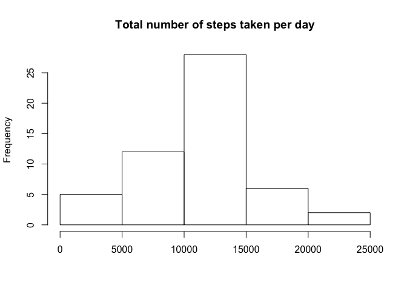
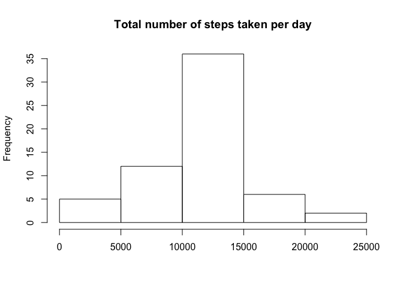
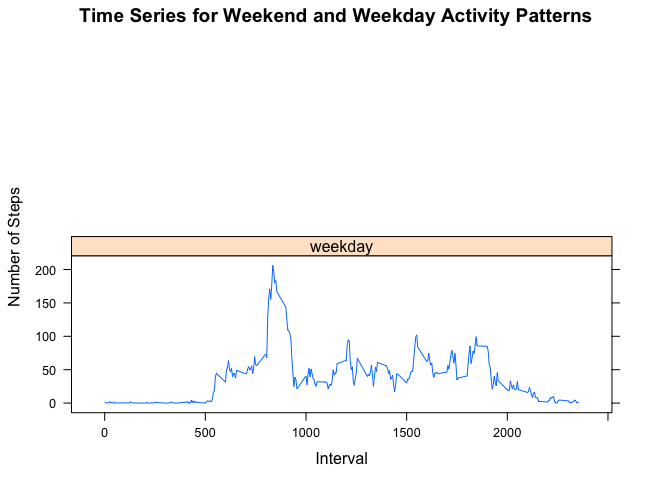

# Reproducible Research: Peer Assessment 1


## Loading and preprocessing the data

```r
filename <- unzip("activity.zip")
activityData <- read.csv("activity.csv")
str(activityData)
```

```
## 'data.frame':	17568 obs. of  3 variables:
##  $ steps   : int  NA NA NA NA NA NA NA NA NA NA ...
##  $ date    : Factor w/ 61 levels "2012-10-01","2012-10-02",..: 1 1 1 1 1 1 1 1 1 1 ...
##  $ interval: int  0 5 10 15 20 25 30 35 40 45 ...
```

Convert date to date format and creating dataset without NAs

```r
activityData$date <- as.Date(activityData$date)
activityComplete <- activityData[complete.cases(activityData),]
str(activityComplete)
```

```
## 'data.frame':	15264 obs. of  3 variables:
##  $ steps   : int  0 0 0 0 0 0 0 0 0 0 ...
##  $ date    : Date, format: "2012-10-02" "2012-10-02" ...
##  $ interval: int  0 5 10 15 20 25 30 35 40 45 ...
```

## What is mean total number of steps taken per day?
 Calculating the total number of steps taken per day

```r
stepsDay<-tapply(activityComplete$steps, activityComplete$date, sum)
```
 
Histogram of the total number of steps taken each day

```r
hist(stepsDay, main = "Total number of steps taken per day", xlab = "")
```

 
 
Calculate and report the mean of the total number of steps taken per day

```r
mean(stepsDay)
```

```
## [1] 10766.19
```

Calculate and report the median of the total number of steps taken per day

```r
median(stepsDay)
```

```
## [1] 10765
```
## What is the average daily activity pattern?

Making a time series plot (i.e. type = "l") of the 5-minute interval (x-axis) and the average number of steps taken, averaged across all days (y-axis)

```r
stepsInterval <- aggregate(steps ~ interval, data = activityComplete, mean)
plot(steps ~ interval, data = stepsInterval, type = "l")
```

 

Which 5-minute interval, on average across all the days in the dataset, contains the maximum number of steps?

```r
stepsInterval[which.max(stepsInterval$steps), ]
```

```
##     interval    steps
## 104      835 206.1698
```

It is the 835-th interval
## Imputing missing values

Calculating and report the total number of missing values in the dataset (i.e. the total number of rows with NAs)

```r
sum(is.na(activityData$steps))
```

```
## [1] 2304
```

2304 rows are missing
Devising a strategy for filling in all of the missing values in the dataset. 
- For filling in all NA the mean for that 5-minute interval was used.

```r
activityNew <- activityData
for (i in 1:nrow(activityNew)) {
    if (is.na(activityNew[i, ]$steps)) {
         intD <-  activityNew[i, ]$interval 
        activityNew[i, ]$steps <- stepsInterval$steps[which(stepsInterval$interval==intD)]
         
     }
 }
```

Making a histogram of the total number of steps taken each day 

```r
stepsDayNew<-tapply(activityNew$steps, activityNew$date, sum)
hist(stepsDayNew, main = "Total number of steps taken per day", xlab = "")
```

 

Calculate and report the mean total number of steps taken per day. 

```r
mean(stepsDayNew)
```

```
## [1] 10766.19
```

Calculate and report the median total number of steps taken per day. 

```r
median(stepsDayNew)
```

```
## [1] 10766.19
```

What is the impact of imputing missing data on the estimates of the total daily number of steps?

```r
mean(stepsDayNew) - mean(stepsDay)
```

```
## [1] 0
```

```r
median(stepsDayNew) - median(stepsDay)
```

```
## [1] 1.188679
```

So we can see that impact is minimal

## Are there differences in activity patterns between weekdays and weekends?

Creatind a new factor variable in the dataset with two levels – “weekday” and “weekend” indicating whether a given date is a weekday or weekend day.

```r
activityNew$day <- as.factor(ifelse(weekdays(activityNew$date) %in% 
                                 c("Saturday","Sunday"),"weekend", "weekday"))
```

Making a panel plot containing a time series plot (i.e. type = "l") of the 5-minute interval (x-axis) and the average number of steps taken, averaged across all weekday days or weekend days (y-axis)

```r
stepsIntervalWeekdays <- aggregate(steps ~ interval + day, activityNew, mean)
library(lattice)
plots <-xyplot(steps ~ interval | day, data = stepsIntervalWeekdays, type = "l", layout = c(1, 2), ylab = "Number of Steps", xlab = "Interval", main = "Time Series for Weekend and Weekday Activity Patterns")
print(plots)
```

 

There are some differences in activity patterns between weekdays and weekends. At workdays people tend to "begin" activities earlier than at weekend. Also at weekends activity more "uniformly" distributed over the day. At workdays we can observe a high peak at the beginning of the day.
